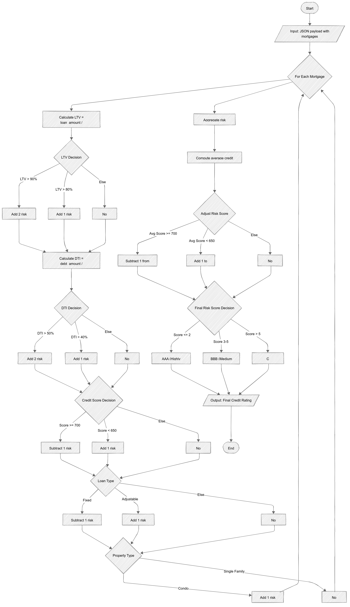

# RMBS Credit Rating Calculator

This project provides a Python-based utility to calculate credit ratings for Residential Mortgage-Backed Securities (RMBS) based on mortgage data.
It evaluates financial risk factors like Loan-to-Value (LTV) ratio, Debt-to-Income (DTI) ratio, credit score, loan type, and property type to determine the final credit rating.

## Flow Diagram



## Features
- Calculates Loan-to-Value (LTV) and Debt-to-Income (DTI) Ratios.
- Evaluates individual mortgage risk scores.
- Derives an overall RMBS Credit Rating — "AAA", "BBB", or "C".
- Includes structured error handling for missing/invalid data
- Contains unit tests and supports test coverage reports.

## Requirements
- Python 3.10+
- Install dependencies:
  ```bash
  pip install -r requirements.txt
  
## Quick Summary

| **Action**                    | **Command**                                    |
|-------------------------------|------------------------------------------------|
| Run unit tests                | python -m unittest test_credit_rating.py       |
| Run tests with coverage       | coverage run -m unittest test_credit_rating.py |
| Show coverage report          | coverage report -m                             |
| Generate HTML coverage report | coverage html                                  |
| Open HTML coverage report     | Open htmlcov/index.html in browser             |

